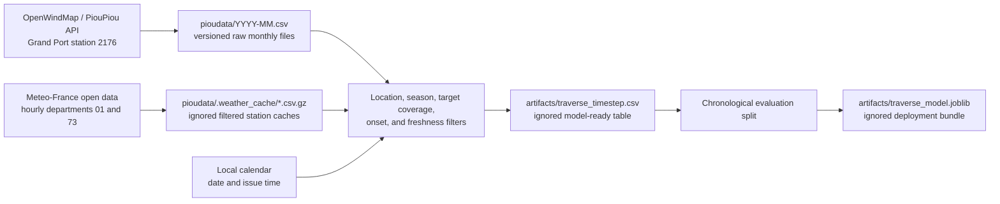
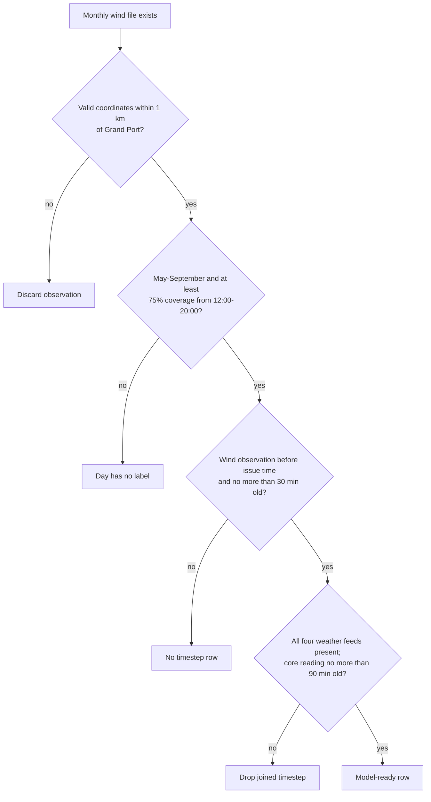
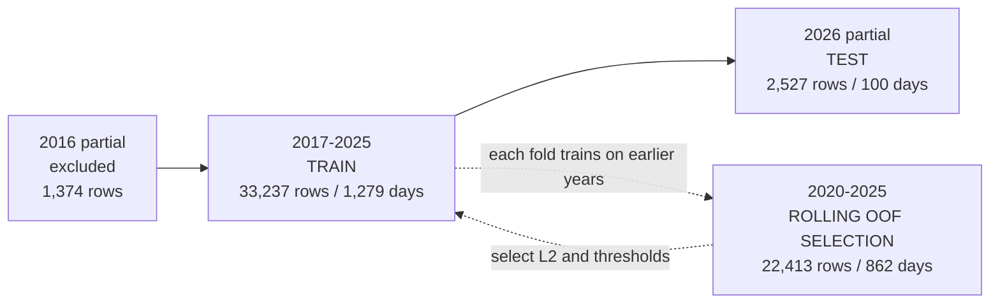

# Data inventory and splits

This document is a snapshot of the data available in this checkout on
**2026-08-31**. The generated dataset ends on the last complete target day,
**2026-08-30**; the refreshed wind and Meteo-France hourly archives both extend
into **2026-08-31**.

The most important distinction is that a file existing for a year does not make
that year complete. A row reaches the model dataset only after location,
coverage, season, freshness, and cross-station join checks. The current local
dataset has **37,138 rows across 1,432 dates**, from 2016-08-09 through
2026-08-30. After retaining every weather quantity available at every station,
it has 206 columns, of which the model can consume 123 non-empty features.

## Where the data comes from



| Data | Upstream | Local copy | What the current pipeline uses | Local coverage |
| --- | --- | --- | --- | --- |
| Grand Port wind | [OpenWindMap](https://www.openwindmap.org/) / `https://api.pioupiou.fr/v1/archive/2176` | `pioudata/YYYY-MM.csv` | Minimum, average, and maximum wind speed plus heading. The same observations define the target. | Monthly filenames exist for 2014-2025 and May-August 2026, but lake-location-valid observations only run from 2016-08-08 through 2026-08-31. |
| Hourly weather | [Meteo-France hourly open data](https://www.data.gouv.fr/datasets/donnees-climatologiques-de-base-horaires) via data.gouv dataset `6569b4473bedf2e7abad3b72` | `pioudata/.weather_cache/meteofrance_*.csv.gz` | Every available quantity at all four stations plus three temperature contrasts. | All four station caches span 2010-01-01 through early 2026-08-31. MONT DU CHAT is missing five observation days in 2017; other gaps can still occur at individual fields/checkpoints. |
| Daily weather | [Meteo-France daily open data](https://www.data.gouv.fr/datasets/donnees-climatologiques-de-base-quotidiennes) via data.gouv dataset `6569b51ae64326786e4e8e1a` | `pioudata/.weather_cache/meteofrance_daily_*.csv.gz` | **Not used by the current dataset builder or model.** These files are leftovers from the earlier daily-maximum-temperature target. | CHAMBERY-AIX cache spans 1973-07-01 through 2026-08-27. |
| Calendar | Derived locally | In the final CSV | Day-of-year and issue-time sine/cosine features. | Wherever a model-ready row exists. |

The four weather stations are:

| Station | ID | Department | Elevation | Retained features |
| --- | --- | --- | ---: | --- |
| CHAMBERY-AIX | `73329001` | 73 | 235 m | Temperature, dew point, humidity, pressure, rain, visibility, cloud, radiation, wind, and freshness/count summaries |
| BELLEY | `01034004` | 01 | 330 m | Temperature, dew point, humidity, rain, wind, and freshness/count summaries |
| NOVALAISE | `73191001` | 73 | 460 m | Temperature, intermittent rain, and freshness/count summaries |
| MONT DU CHAT | `73051001` | 73 | 1,496 m | Temperature, dew point, humidity, rain, wind, and freshness/count summaries |

The feature builder emits the same full schema for every weather station, but
model training removes columns that are empty throughout the fit period. The
archive contains pressure, visibility, cloud, and radiation only at
CHAMBERY-AIX. BELLEY and MONT DU CHAT additionally provide moisture, rain, and
wind; NOVALAISE adds only intermittent rain. Auxiliary feed freshness remains
temperature-based so retaining optional fields does not change which rows enter
the comparison.

`pioudata/big.csv` and `pioudata/big-2024.csv` are legacy aggregate wind dumps.
The current loader deliberately ignores them: it only accepts filenames matching
`YYYY-MM.csv`.

Live inference pulls the last day from the same PiouPiou station and queries the
four stations through Meteo-France's public hourly observation API. Those live
responses are not added to the retrospective caches by inference.

## What “complete” means



The current target is a **wind-rule candidate**, not an independently observed
Traverse. An in-season day is positive when `[12:00, 20:00)` contains a
sustained run of at least 30 minutes with average wind at least 18.52 km/h from
225-315 degrees, with no qualifying-sample gap over 10 minutes. There is
currently **no temperature condition** in `target_label`.

Serialized `label_config` metadata still carries the legacy
`hot_day_temperature_threshold_c` and `hot_day_station_id` keys so older live
runtimes can load a newly trained bundle. They are compatibility metadata only;
`target_label` does not read them.

There are up to 27 half-hour checkpoints per date, from 06:30 through 19:30.
Positive rows at or after the first qualifying onset are intentionally excluded,
so fewer than 27 rows on a positive date does not by itself indicate missing
data.

## Coverage by year

“Label-ready” means the wind target has sufficient target-window coverage.
“Final days” means at least one row survives both wind and four-station weather
requirements. A normal May-September season contains 153 calendar days.

| Year | Role | Label-ready days | Final days | Rows | Positive days | What is incomplete |
| ---: | --- | ---: | ---: | ---: | ---: | --- |
| 2016 | Excluded partial history | 53 | 53 | 1,374 | 9 | Begins 2016-08-09; not part of any fit or evaluation split |
| 2017 | Train | 153 | 153 | 4,012 | 14 | Full season at the day level |
| 2018 | Train | 151 | 146 | 3,753 | 28 | Two days fail wind-label coverage; 2018-09-19 through 2018-09-23 are then lost at the weather join |
| 2019 | Train | 118 | 118 | 3,059 | 17 | 35 in-season days have no label-ready wind coverage |
| 2020 | Train | 150 | 150 | 3,868 | 22 | Three in-season days have no label-ready wind coverage |
| 2021 | Train | 148 | 148 | 3,878 | 23 | Five in-season days have no label-ready wind coverage |
| 2022 | Train | 153 | 153 | 4,023 | 22 | Full season at the day level |
| 2023 | Train / rolling OOF | 151 | 151 | 3,929 | 21 | Two in-season days have no label-ready wind coverage |
| 2024 | Train / rolling OOF | 153 | 153 | 3,902 | 27 | Full season at the day level |
| 2025 | Train / rolling OOF | 107 | 107 | 2,813 | 17 | Partial season only: May 1 through August 15 |
| 2026 | Test | 100 | 100 | 2,527 | 11 | Partial season only: May 23 through August 30 |

Consequently, **2017, 2022, and 2024 are the only full 153-day seasons in the
final table**. The 2026 test is also partial and should not be interpreted as a
complete-season result.

The raw wind inventory contains 1,215,257 rows. Location filtering rejects
55,004 rows, timestamp deduplication removes 586 more, and 1,159,667 unique
lake-location-valid observations remain. File counts alone overstate usable
coverage, especially where archived rows have missing or displaced coordinates.

## Current train / test split



The artifact has one fit period and one test period. Expanding-year folds ending
in 2020 through 2025 generate chronological out-of-fold predictions within the
training period. Those predictions select L2 and alert thresholds. The saved
pipeline then fits every 2017-2025 training row. Partial 2026 is evaluated once
and is never used for fitting or selection.

## Refresh and verify

Refresh one Windbird year month by month:

```bash
uv run --frozen python -m scripts.fetch_piou_archive \
  --station-id 2176 --year 2026
```

Rebuild from the current monthly files and already cached weather data:

```bash
uv run --frozen python -m scripts.build_timestep_dataset --offline
```

The resulting `artifacts/traverse_timestep.metadata.json` is the authoritative
snapshot for row count, date range, label contract, station contract, and CSV
checksum. `artifacts/traverse_model.metadata.json` is authoritative for the
evaluation split, deployment-fit years, feature names, and thresholds. Both
directories are ignored by Git, so another checkout may not have the same
generated snapshot until it is rebuilt.
