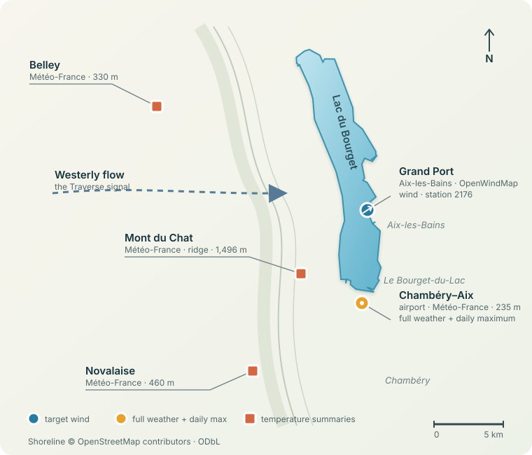

# Same-day Traverse predictor

The live model predicts whether at least 30 minutes of westerly wind at 10 knots
(18.52 km/h, direction 225°–315°) remain in today's afternoon. Its target window
is `[max(12:00, issue time), 20:00)` in Europe/Paris, May through September.
It scores from 06:30 through 19:30 inclusive, leaving enough time for a full
30-minute spell. Continuing wind and later spells count even after an earlier
onset. Observations strictly before issue time are the only predictors.

## Model

The pinned model uses the evaluated 94-feature histogram gradient booster with
median imputation, seven leaves, 200 iterations and `L2=10`. It retains the
existing PiouPiou summaries, CHAMBERY-AIX weather, auxiliary-station temperatures
and thermal contrasts. Training covers 2017–2025, includes post-onset rows, and
gives every date equal weight with uniform weighting within each date.

On rolling 2020–2025 development folds, mean average precision across 08:00,
10:00, 12:00, 14:00, 16:00 and 18:00 rises from `0.2047` for the previous model
to `0.2564` on identical remaining-window labels. The paired whole-date 95%
gain interval is `[+0.0296, +0.0732]`. Brier score improves at every checkpoint;
08:00 ranking is slightly worse, and gains are strongest at 16:00 and 18:00.
These are reused development folds, not an independent final test. This model
has no new 2026 evaluation, alert threshold, or onset-time companion.

The deployment export preserves the fitted pipeline exactly. The live response
retains `traverse_probability`, identifies `model_kind: remaining_wind`, and
reports the target window. `predict_traverse` is null because no alert threshold
has been selected; `onset_within_probabilities` is empty. A past observed onset
is monitoring information and does not suppress the remaining-wind forecast.

See the [remaining-wind experiment](experiments/20260905-remaining-wind-model/plan.md)
for the reproducible comparison and the
[deployment record](experiments/20260906-remaining-wind-deployment/plan.md) for
packaging and verification. The website's old 2026 audit and archived onset
forecasts remain labeled as previous-model results.

## Data sources

The model observes the lake directly and samples the air mass around it,
especially to the west where a Traverse arrives from. The map shows every
station currently used by the feature pipeline; it is not a map of candidate
stations.



The table inventories the quantities retained by the current feature pipeline.
An em dash means that the quantity is not used from that station, even if it
exists in the upstream archive.

| Station and source | Wind | Temperature | Moisture | Pressure | Rain | Cloud and visibility | Sun and radiation |
| --- | --- | --- | --- | --- | --- | --- | --- |
| **Grand Port, Aix-les-Bains** (`2176`)<br>[OpenWindMap](https://www.openwindmap.org/) PiouPiou/Windbird | Minimum, average, maximum/gust (`km/h`); direction (`°`); morning mean, trend, westerly component, and freshness | — | — | — | — | — | — |
| **CHAMBERY-AIX airport** (`73329001`)<br>Météo-France · [public station view](https://www.meteociel.fr/temps-reel/obs_villes.php?code2=73329001) | 10 m speed (`m/s`); direction (`°`); latest, morning mean/change, and mean westerly component | Air temperature and dew point (`°C`): latest, morning mean/change; dew-point depression | Relative humidity (`%`): latest and morning mean/change | Mean-sea-level and surface pressure (`hPa`): latest and morning mean/change | Hourly precipitation accumulated since 06:00 (`mm`) | Visibility (`m`): latest and morning mean/change; mean cloud cover (`oktas`) and sky-obscured fraction | Sunshine duration (`min`); global, direct, and diffuse radiation totals (`J/cm²`) and means (`W/m²`) |
| **BELLEY** (`01034004`)<br>Météo-France | 10 m speed and direction summaries | Air temperature and dew point summaries; dew-point depression | Relative-humidity summaries | — | Morning accumulation | — | — |
| **NOVALAISE** (`73191001`)<br>Météo-France | — | Air-temperature summaries | — | — | Intermittent morning accumulation | — | — |
| **MONT DU CHAT** (`73051001`, ridge)<br>Météo-France | 10 m speed and direction summaries | Air temperature and dew point summaries; dew-point depression | Relative-humidity summaries | — | Morning accumulation | — | — |

The three auxiliary stations retain every quantity present in their archives.
Their temperature readings form Belley-minus-airport, Novalaise-minus-airport,
and Belley-minus-Mont-du-Chat contrasts, representing the lowland, lake-side,
and ridge temperature structure west of the lake. Secondary feed freshness
remains temperature-based because NOVALAISE does not publish the full
humidity/wind bundle, so optional fields do not change row membership.
CHAMBERY-AIX is therefore the same airport station often identified by the WMO
code `07491`; it is not an additional sixth source.

For retrospective builds, the repository keeps monthly OpenWindMap CSVs and
downloads the required Météo-France hourly open-data archives by
department. Live inference reads the same four Météo-France sites from the
public observation API. At every issue time, only observations strictly before
that time are exposed to the model. Weather summaries start at 06:00 local time
and their latest core reading must be no more than 90 minutes old; Grand Port
wind summaries start at 06:00 and must be no more than 30 minutes old.

Wind data attribution: © contributors of the
[OpenWindMap wind network](https://www.openwindmap.org/). Map shoreline:
© [OpenStreetMap contributors](https://www.openstreetmap.org/copyright), ODbL.

## Build, train, and test

Python 3.11 and [uv](https://docs.astral.sh/uv/) are required.

The research build and chronological evaluation commands are in the
[experiment record](experiments/20260905-remaining-wind-model/plan.md). Export the
already fitted control without training again:

```bash
uv sync --frozen
uv run --frozen python -m scripts.remaining_wind export \
  --output-dir artifacts/remaining_wind_current_definition
uv run --frozen python -m unittest discover -v
```

Generated datasets, weather caches, model artifacts, and W&B runs are ignored
by Git. `scripts.train`, `scripts.predict_dataset`, and `eval_model.py` describe
the previous onset model; its evaluators reject the new remaining-window bundle
to avoid scoring against incompatible labels.

## Predict

Score an existing dataset row:

```bash
uv run python -m scripts.predict --date 2025-07-21 --time 12:00 \
  --dataset artifacts/remaining_wind_current_definition/dataset.csv
```

Prepare and score an arbitrary minute:

```bash
uv run python -m scripts.prepare_timestep \
  --date 2025-07-21 \
  --time 13:17 \
  --offline-weather \
  --output artifacts/timestep_features.csv

uv run python -m scripts.predict \
  --features artifacts/timestep_features.csv
```

The JSON response includes the remaining-wind probability and a separate
`onset_evidence` value: the latest westerly wind component as a fraction of
18.52 km/h, clipped to `[0, 1]`. This physical evidence index is not another
probability. The live endpoint continues forecasting after an observed onset.

With `METEOFRANCE_TOKEN` set, serve the current live prediction at
`GET /predict`:

```bash
TRAVERSE_MODEL=artifacts/traverse_model.joblib \
  uv run uvicorn api:app
```

The same server exposes a historical dashboard at
`http://127.0.0.1:8000/dashboard`. It shows wind-rule Traverse candidates by
year and a shared 12:00–21:00 timeline with wind in knots, flow-direction
needles, advance probability, physical onset evidence, the event-onset boundary,
ordered 1-, 2-, and 3-hour onset estimates, CHAMBERY-AIX temperature, and either
cloud cover or solar radiation when cloud cover is unavailable. The 2026 view
also compares event-day AP at three-, two-,
and one-hour lead and summarizes early-alert rate, false-alert days, median
warning time, and the share of events whose onset evidence rises over the final
six hours. Rule matches are candidates, not independently confirmed Traverse
observations. Dashboard data is built from
the local archives on first load and then cached in memory. This local dashboard
retains the previous onset-model audit; use the public page for the new live model.

## All-variable auxiliary-station experiment

The data pipeline now retains every weather field supplied by each auxiliary
station rather than discarding everything except temperature. This expands a
freshly trained model from 94 to 123 non-empty features without changing any
rows or dates. The additional fields are wind, moisture, and rain from BELLEY
and MONT DU CHAT plus intermittent rain from NOVALAISE; the archives do not
provide pressure at those three sites.

The change is not an established accuracy improvement. On rolling 2020–2025
predictions, adding every available auxiliary field reduced three-hour
event-day AP from `0.2331` to `0.2184` (paired day-bootstrap difference
`-0.0147`, 95% interval `[-0.0406, +0.0132]`). On partial 2026 it increased AP
from `0.1747` to `0.2497` (`+0.0751`, interval `[+0.0044, +0.2057]`), but that
slice contains only 11 events and false-alert days rose from `20.2%` to `29.2%`.

Auxiliary wind alone is the promising narrower hypothesis: rolling AP was
effectively tied at `0.2370`, while partial-2026 AP was `0.2630`. Moisture and
rain reduced AP on both slices. The remaining-wind deployment also uses the
original 94 features; see the
[full ablation record](experiments/20260902-all-station-weather-ablation/plan.md).

A subsequent fixed-model experiment tested one- and three-hour temperature,
radiation and wind changes from the existing caches. Thermal changes raised
historical three-hour AP from `0.2331` to `0.2403`, with paired 95% difference
interval `[-0.0052, +0.0198]`; wind changes and the combined block scored lower.
No variant increased event coverage at a common 20% false-alert-day ceiling.
This is not an established improvement. The
[weather-dynamics experiment](experiments/20260905-weather-dynamics/plan.md)
records the protocol and results; it does not reevaluate 2026 or fit a new
deployment bundle.

## Publish the live GitHub Pages prediction

The public page at <https://tcapelle.github.io/pioupiou/> reads the latest result
from `live-data/current_prediction.json`. GitHub Pages is configured to serve
`main/docs`, while the inference computer updates only the data branch.

`deployment_model.json` pins the live model to an immutable GitHub Release URL
and SHA-256. Before every API or publisher prediction, the inference process
checks `artifacts/traverse_model.joblib` and atomically downloads the pinned
bundle when the local file is missing or stale. Pulling and restarting the
merged code therefore selects the model declared by that commit rather than an
untracked artifact left on the inference computer.

### Run the publisher in a terminal

Open a fresh terminal in this repository and confirm the local prerequisites:

```bash
cd /path/to/pioupiou
uv sync --frozen
test -f artifacts/traverse_model.joblib
test -n "$METEOFRANCE_TOKEN"
git ls-remote origin HEAD
```

The two `test` commands produce no output when successful. Set
`METEOFRANCE_TOKEN` in that terminal first if the second command fails. Inspect
one result locally without pushing:

```bash
uv run --frozen python -m scripts.publish_live --dry-run
```

Then start the publisher and leave the terminal open:

```bash
uv run --frozen python -m scripts.publish_live --watch --interval 300
```

It publishes immediately, then every five minutes. Stop it with `Ctrl-C`; rerun
the same command after restarting the terminal or computer. The publisher
force-replaces the `live-data` branch with one root commit, so updates do not
accumulate Git history. The page marks a result stale after 15 minutes.

### Previous-model date browser

The public date browser retains the previous onset model’s reconstructed 2026 predictions,
the PiouPiou observation available strictly before each issue time, and a small
audit summary derived from the prediction metadata. These are labeled separately
from contemporaneously published live results.

Keep existing reconstructed history when deploying the remaining-wind model.
The old onset evaluator and history-builder commands require an explicitly
selected legacy bundle; do not rebuild old onset labels with the new model.

After the one-time seed, the normal `--watch --interval 300` command preserves
the daily files, appends or replaces the current five-minute point, rebuilds the
date index, and amends the branch's single root commit. Restart an already
running publisher after updating the repository so it uses this archive-aware
behavior.

`joblib` uses pickle semantics. Load only trusted model bundles. A downloaded
artifact can be checked before deserialization with `--model-sha256`.

## Future webcam experiments

The standalone Grand Port webcam pipeline is retained for future image-model
research. It inventories timestamped frames, creates a reviewable selection,
and downloads only that frozen selection; it is not part of the current model.

```bash
uv run python -m scripts.image_pipeline inventory \
  --start-date 2024-01-01 --end-date 2025-08-15

uv run python -m scripts.image_pipeline plan \
  --start-date 2024-01-01 --end-date 2025-08-15 \
  --from-time 08:00 --until-time 12:00 \
  --stride 2 --quality mini

uv run python -m scripts.image_pipeline download
```

Inventory metadata, selections, and downloaded images remain ignored under
`artifacts/webcam_grandport/`. Confirm bulk collection and machine-learning
rights with the image rightsholders before downloading a corpus.

## Data and label

Refresh the current Windbird archive month by month (the API rejects overly
large ranges):

```bash
uv run --frozen python -m scripts.fetch_piou_archive --station-id 2176 --year 2026

# Previous onset-model research workflow; this does not update the deployment pin.
uv run --frozen python -m scripts.build_timestep_dataset
uv run --frozen python -m scripts.train \
  --wandb-name 2026-holdout-dashboard \
  --wandb-mode disabled
uv run --frozen python -m scripts.predict_dataset \
  --year 2026 \
  --output artifacts/traverse_predictions_2026.csv
```

The monthly Windbird CSVs are source data and are versioned. Weather caches,
joined features, model bundles, and prediction outputs remain ignored under
`pioudata/.weather_cache/` and `artifacts/` and can be reproduced with the
commands above.

PiouPiou observations with missing coordinates or coordinates more than 1 km
from the lake station are rejected. Météo-France observations must match the
configured CHAMBERY-AIX station location and use accepted quality codes 0, 1,
or 9.

A checkpoint is in scope only from May 1 through September 30. It is positive when
observations in `[max(12:00, issue time), 20:00)` show wind of at least 18.52 km/h from
225°–315° for one sustained run of at least 30 minutes, with qualifying-sample
gaps no larger than 10 minutes. Temperature remains a predictor but is not part
of the target. Dates outside the season and days below 75% target-window
coverage have an unknown label and are excluded from training.

The [afternoon-label audit](experiments/20260905-afternoon-label-audit/plan.md)
checks this definition against the practical objective of knowing early
whether the afternoon will be windy. On the same 1,279 historical dates,
counting all directions at 10 knots for 30 minutes would increase positive
days from 191 to 350. The audit also documents how strict run continuity and
the three-hour warning metric differ from a planning decision updated through
the afternoon. Of current events, 64% start at or after 16:00; extending the
existing westerly target window to 21:00 adds 50 qualifying historical dates.

The [remaining-wind research model](experiments/20260905-remaining-wind-model/plan.md)
rebuilds labels at every checkpoint, retains post-onset examples, and removes
the short-lead training penalty. A control using the existing 10-knot westerly
rule and 20:00 cutoff improves mean checkpoint AP from `0.2047` to `0.2564`
on historical 2020–2025 predictions scored against the same remaining-window
labels. Gains are strongest at 16:00 and 18:00; 08:00 ranking is slightly worse.
This candidate is now the pinned live model. These remain development results,
not a new independent test.

This is a leakage-free retrospective prototype, not a production warning
service. Do not tune feature choices or thresholds on the held-out years.
